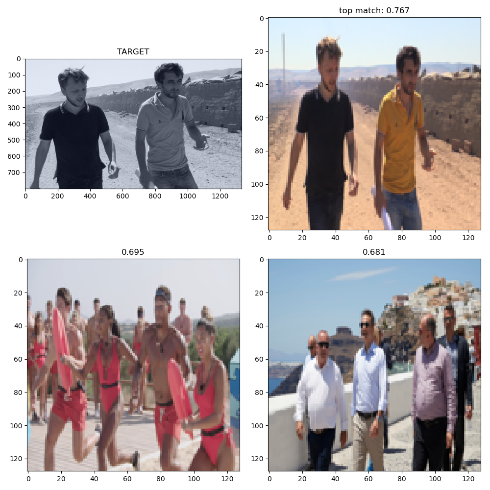
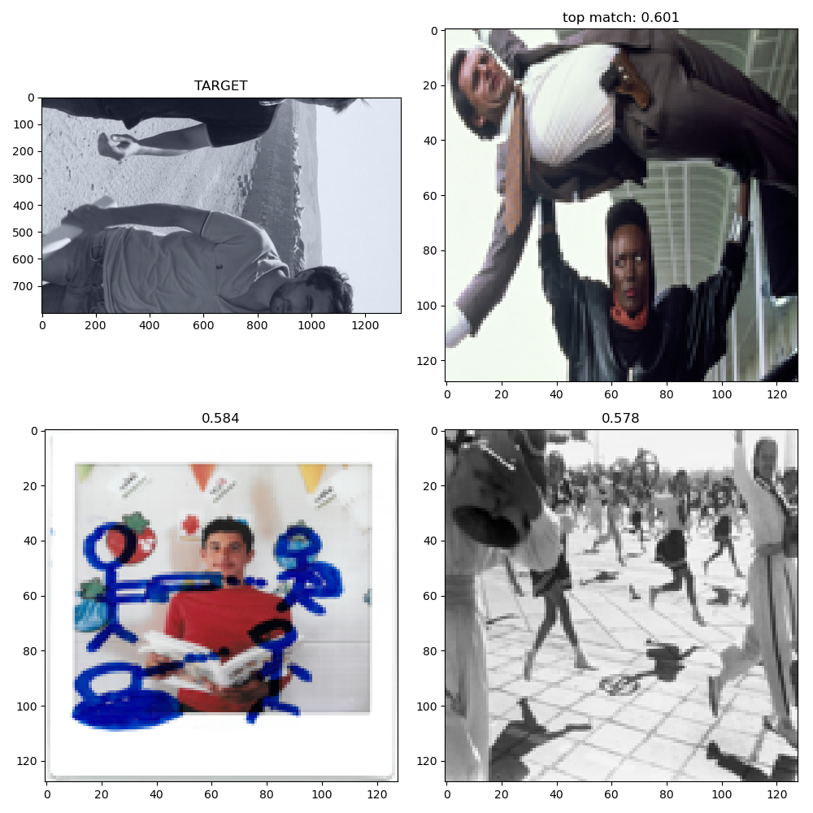
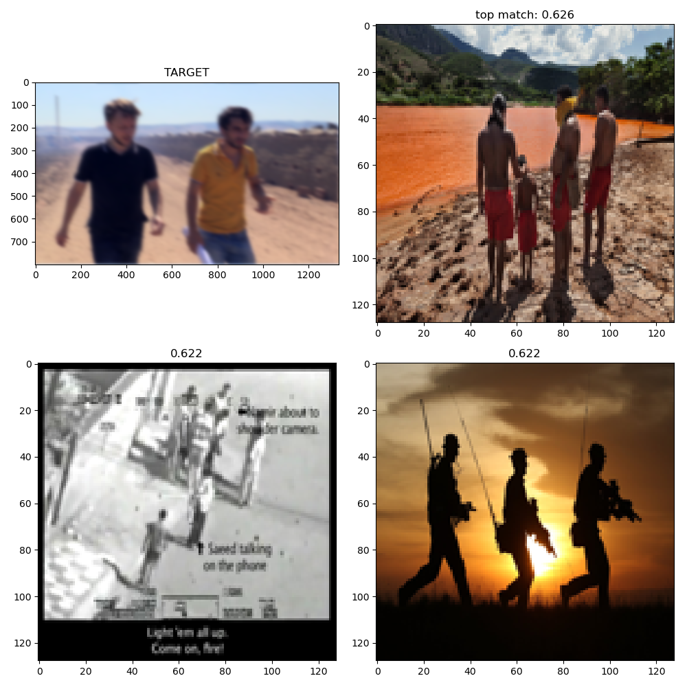
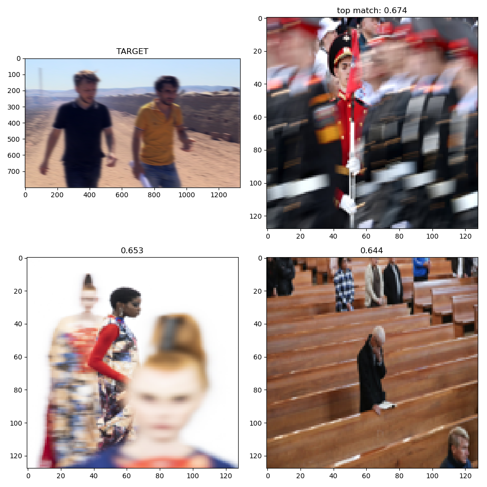
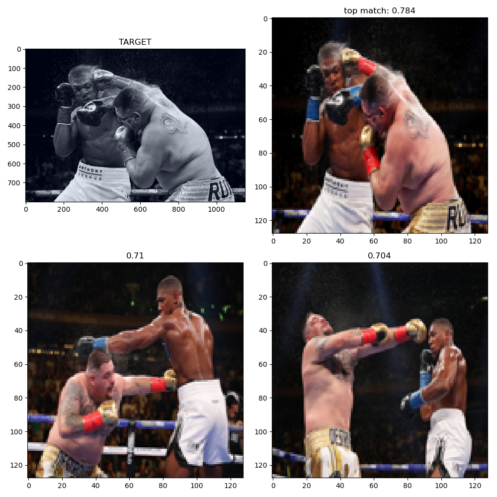
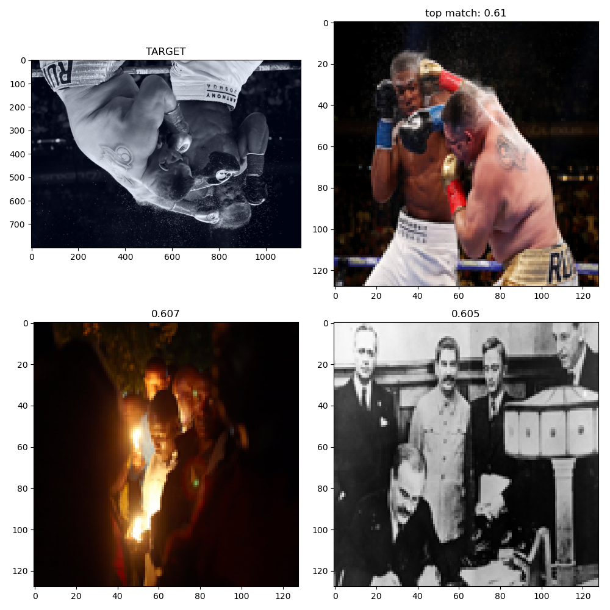
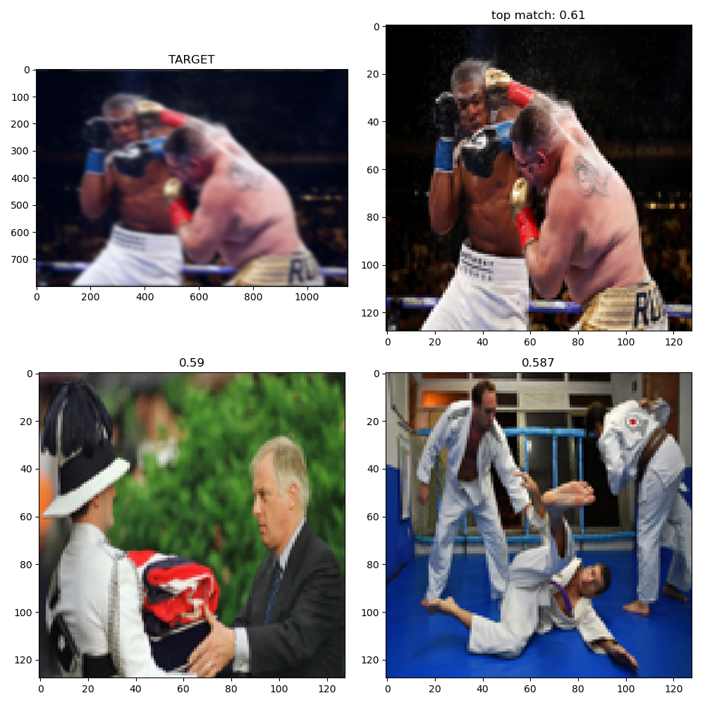
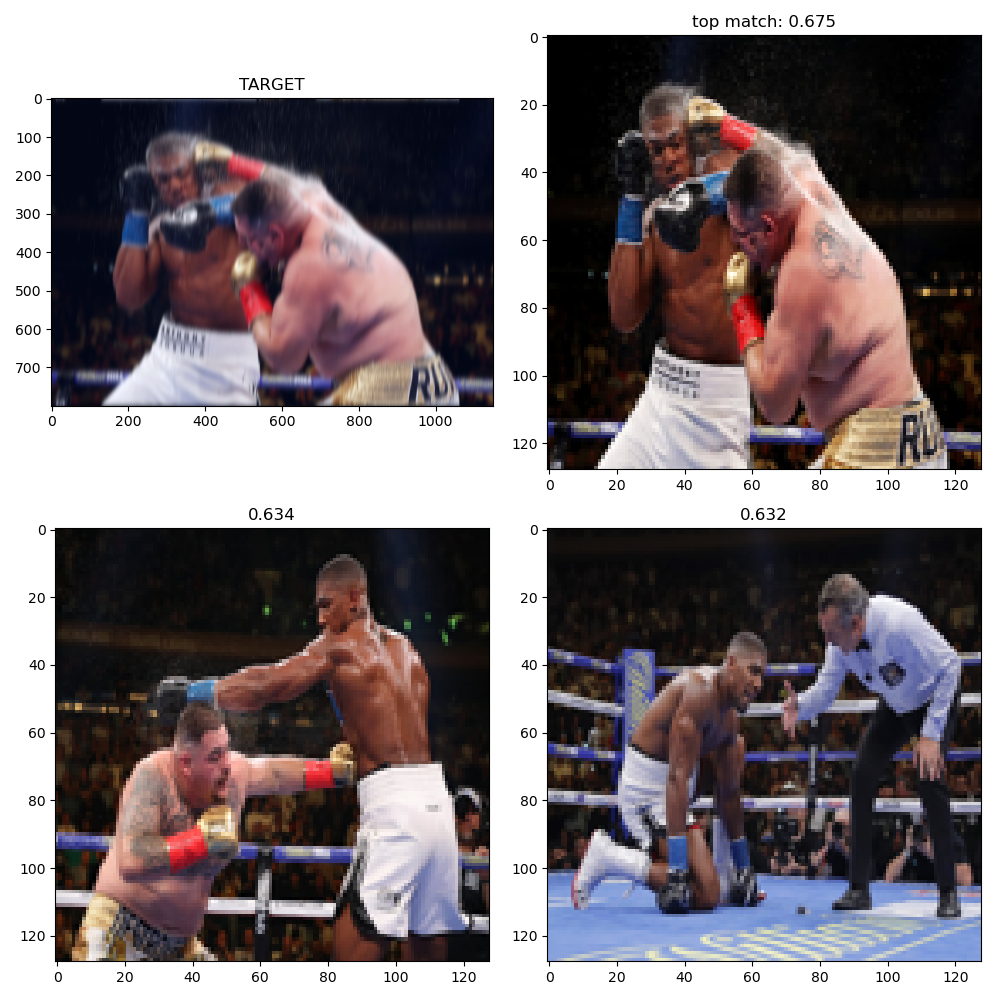

# Questions and Curious that appear on looking at this work.

At first glance it appears that Dino finds the self information of the image; offering some surprising consistency in video segmentation--as shown on the paper's examples--even when each frame is individually processed.  

Questions on looking at this work:

1. What does it see.<br>

2. Can it be leveraged on downstream tasks.  <br>

3. a. What is it robust to, b. what are its failure points, c. can it be trained past thee failure points? <br>

Most images in this .md are from a large imgae dset of crowds systematically scraped, links to original images provided. All evaluation was done on pretrained models from dino. <br>

## Biases and Characteristics of pretrained Dino / attention visualization
Images shown here were processed with modification of *video_generation.py*
```python
from x_infer_simple import InferDino, show
D = InferDino() 
D.run(<imagename>, crop=(y0,y1,x0,x1))
show(D.lump( save=<filename>))
# or
D.batch(input_folder=<>, output_folder=<>)
```
or
```bash
#!/bin/bash #requires ffmpeg
python x_video_generation.py --input_path <> --output_path <> --frames <start end> --as_video 1 --crop <ints y0 y1 x0 x1>
```

<details>
  <summary>  Focus Bias appears strongly in Dino, this is probably inherent to the architecture. <br> While attention heads have less dependence on pixel neighborhood thatn convolutions, weigths still are triggered by distinct pixel steps <br>
     </summary>

  <div align="center">
<td>  
</td>
<a href='https://i.guim.co.uk/img/media/5ef7400158bf88db31347de8e6bb023d5a443f13/0_230_5649_3390/master/5649.jpg?width=1920&quality=85&auto=format&fit=max&s=1ab893b235820659589fa2c786e4d5f6'>Image source</a>
</div>
</details>

<details>
  <summary> Center Bias<br> was tested by running Dino, rolling the image and rerunning it. Not only the balance of attention changes but also its absolute values. This perhaps could be trained against.<br>
  
   
   
   
  
  </summary>
<div align="center">
<table><tr>
<td>  </td>
<td> </td>

<td>  </td>
<td> 
</td>
</tr></table>
</div>
<div align="left">
<a href='https://www.theguardian.com/world/gallery/2020/jan/13/lava-gushes-from-taal-volcano-in-philippines-in-pictures#img-8'>Image1 source</a>
</div>
<div align="right">
<a href='https://www.theguardian.com/artanddesign/gallery/2020/apr/04/20-photographs-of-the-week#img-12'>Image2 source</a>

</div>

</details>

<details>
  <summary> Intrusion of Image Artifacts <br>
  Dino appears to excell at finding what does not belong in the image. When artifacts appear, they can become center of attention.<br>
  
   
  
  </summary>

Image of sunset has artifacts from poor video compression, which dissappear when cropped.<br>
On the corrupted film, the human is not highlit, while artifacts are included the highest magnitude of attention picks up brick patterns.
<div align="center">
<table><tr>

<td>  </td>
<td>  </td>
<br>
<td> 
<a href='https://www.theguardian.com/artanddesign/2019/jul/05/prix-pictet-2019-shortlist-photo-essay#img-23'>Image source</a>
</td>
</tr></table>
</div>
</details>

<details>
    <summary> Excells separating subjects from natural textures, even when those are sharp. Straight, even thickness lines are attract generally simlar magnitude of attention. <br>
     
     
     
     </summary>

<div align="center">
<table><tr>
<td>  
<a href='https://www.theguardian.com/artanddesign/gallery/2020/jun/06/20-photographs-of-the-week#img-20'>Image source</a></td>
</td>
<td> 
<a href='https://www.theguardian.com/environment/2019/jul/16/death-toll-from-floods-in-south-asia-rises-to-more-than-100#img-2'>Image source</a></td>
<td> 
<a href='https://www.lapresse.ca/affaires/marches/201907/04/01-5232681-les-bourses-europeennes-sans-direction-en-labsence-de-wall-street.php'>Image source</a></td>
</tr></table>
</div>

</details>

<details>
    <summary>Glasses, tight patterns and unnatural colors appear to attract most attention. <br>
     
     
     
     </summary>
<div align="center">
<table><tr>
<td> 
<a href='https://www.theguardian.com/film/2020/may/29/do-i-really-care-woody-allen-comes-out-fighting#img-1'>Image source</a>
</td>
<td>  
<a href='https://www.theguardian.com/media/gallery/2019/jun/12/a-lost-elephant-and-hong-kong-protests-wednesdays-best-photos#img-10'>Image source</a>
</td>
<td> 
<a href="https://www.theguardian.com/us-news/2020/feb/11/trump-roger-stone-sentencing-reaction-criticism#img-1">Image source</a>
</td>
</tr></table>
</div>

</details>

## image similarity
Modification of *eval_copy_detection.py*
```python
from x_get_similar import make_dataset, find_matches
pt = make_dataset(<path>, resize=(512,512), batch_size=16, patch_size=8, arch="vit_small", savename="vit_small_512_8.pt")
#... ~ 3 it/s on my system, batchsize can be increased
find_matches(<image_path | augmented tensor>, pt)
```
As mentioned in the paper, Dino works brilliantly on the CopyDays dataset. To validate what it sees and where it fails, I tested briefly with my own augmentation pipeline. The examples shown here are ***generally*** consistent on other data. <br>

* Dino is mostly resilient to **non uniform scaling, hue, saturation** perturbations.
* Features show strong preference twoards angles and sharp edges in that they fail on **large rotations, blur, and directional blur**.
<br>

While blur could be thought of as downscaling, and while Dino is robust to scaling in spite of constant size attention support; blur prevents the pretrained features from activating. This supports the finding that Deep Nets learn surface regularities *(todo fill missing citation, I seem to recall is part of Bengio's work.)*

### Question, can training with deeper augmentation?
Can a more thorough augmentations strategy, as in Noisy Student or stylegan_ADA *(todo fill missing citations)*, result in dino trained to be robust to hi rotations, blurs, and other surface regularities effects? Or a rotational invariant operator is necessary? - TODO: testing

<div align="center">
<table><tr>
<td> Pretrained dino is very robust to non uniform scaling, small rotations, hue and saturation changes/

<!-- <a href=''>Image source</a></td> -->
<td> High Rotations(pi/2 - 3pi/2) reveal a strong bias towards angles. 
<!-- <a href=''>Image source</a></td> -->
</td>
</tr></table>
<table><tr>

<td> Gaussian Blur (3%) of a large image is not the same as scaling. 
<!-- <a href=''>Image source</a></td> -->
</td>
<td> Directional blur, flummoxes dino (3% 45 deg)

<!-- <a href=''>Image source</a></td> -->
</td>
</tr></table>
</div>

Exeptions to the statements above, some images have very distinctive features, which make them impervious to the aforementioned transformations

<div align="center">
<table><tr>
<td> Scaling Saturation</td>
<td> High Rotation</td>
<td> Gaussian Blur</td>
<td> Directional Blur</td>
</tr></table>
</div>